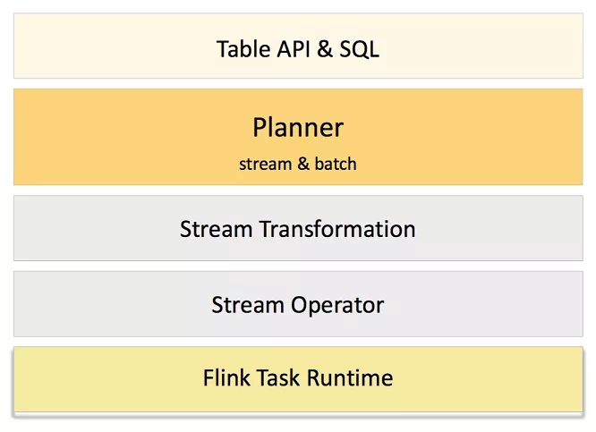

# Flink 流批一体

## Legacy Planner 架构

经典架构

Flink 默认的 Legacy Planner 会将 SQL/Table 程序翻译为 DataStream 或 DataSet 程序，而新的 Blink Planner 则统一翻译为 DataStream 程序。也就是说通过 Blink Planner，Flink Table API 事实上已经实现了流批一体的计算。要了解 Blink Planner 是如何做到的，首先要对 Planner 的工作原理有一定的了解。

1. 用基于 Calcite 的 SQL parser 解析用户提交的 SQL，将不同类型的 SQL 解析为不同 Operation（比如 DDL 对应 CreateTableOperation，DSL 对应 QueryOperation），并将 AST 以关系代数 Calcite RelNode 的形式表示。
2. 根据用户指定 TableEnvironment 的不同，分别使用不同的翻译途径，将逻辑关系代数节点 RelNode 翻译为 Stream 的 Transformation 或者 Batch 的 Operator Tree。
3. 调用 DataStream 和 DataSet 对应环境的方法将 Transformation 或 Operator Tree 翻译为包含执行环境配置的作业表示，即 StreamGraph 或 Plan。
4. 优化 StreamGraph 和 Plan，并包装为可序列化的 JobGraph。

## 1.9-1.10过渡架构

Blink Planner 做的最重要的一点就是废弃了 DataSet 相关的翻译途径，将 DateSetRel 也移植到 DataStream 之上，那么前提当然是 DataStream 要可以表达 DataSet 的语义。熟悉批处理的同学可能会有疑问: 批处理特有的排序等算子，在 DataStream 中是没有的，这将如何表达？

事实上 Table Planner 广泛采用了动态代码生成，可以绕过 DataStream API 直接翻译至底层的 Transformation 和 StreamOperator 上，并不一定需要 DataStream 有现成的算子，因此使用 Blink Planner 的 Table API 与 DataStream API 的关系更多是并列的关系。这也是 FLIP-32[5] 所提到的解耦 Table API 和 DataStream/DataSet API 的意思.

另外虽然 Blink Planner 在计算上是流批一体的，但 Flink Table API 的 TableSource 和 TableSink 仍是流批分离的，这意味着目前绝大数批处理场景的基于 BatchTableSource/BatchTableSink 的 Table 无法很好地跟流批一体的计算合作，这将在 FLIP-95[9] 中处理。

## 未来架构

因此，要实现真正的流批一体，Flink 需完成 Table/SQL API 的和 DataStream/DataSet API 两层的改造，将批处理完全移植到流处理之上，并且需要兼顾作为批处理立身之本的效率和稳定性。目前流批一体也是 Flink 长期目标中很重要一点，流批一体的完成将标志着 Flink 进入 2.x 的新大版本时代。

## 涉及难点

在 DataStream API 方面，虽然目前的 DataStream API 已经可以支持有界数据流，但这个支持并不完整且效率上比起 DataSet API 仍有差距。为了实现完全的流批一体，Flink 社区准备在 DataStream 引入 BoundedStream 的概念来表示有界的数据流，完全从各种意义上代替 DataSet

### Task 线程模型

批处理业务场景通常更重视高吞吐，出于这点考虑，Batch Task 是 pull-based 的，方便 Task 批量拉取数据。Task 启动后会主动通过 DataSet 的 Source API InputFormat 来读取外部数据源，每个 Task 同时只读取和处理一个 Split。
相比之下，一般流处理业务场景则更注重延迟，因此 Stream Task 是 push-based 的。

### 调度策略及容错

众所周知，批处理作业和流处理作业在 Task 调度上是很不同的。批处理作业的多个 Task 并不需要同时在线，可以根据依赖关系先调度一批 Task，等它们结束后再运行另一批。

相反地，流作业的所有 Task 需要在作业启动的时候就全部被调度，然后才可以开始处理数据。前一种调度策略通常称为懒调度（Lazy Scheduling），后一种通常称为激进调度（Eager Scheduling）。为了实现流批一体，Flink 需要在 StreamGraph 中同时支持这两种调度模式，也就是说新增懒调度。

随调度而来的问题还有容错，这并不难理解，因为 Task 出现错误后需要重新调度来恢复。而懒调度的一大特点是，Task 计算的中间结果需要保存在某个高可用的存储中，然后下个 Task 启动后才能去获取。

而在 1.9 版本以前，Flink 并没有持久化中间结果。这就导致了如果该 TaskManager 崩溃，中间结果会丢失，整个作业需要从头读取数据或者从 checkpoint 来恢复。这对于实时流处理来说是很正常的，然而批处理作业并没有 checkpoint 这个概念，批处理通常依赖中间结果的持久化来减小需要重算的 Task 范围，因此 Flink 社区引入了可插拔的 Shuffle Service 来提供 Suffle 数据的持久化以支持细粒度的容错恢复，具体可见 FLIP-31[8]。

### 计算模型及算法

与 Table API 相似，同一种计算在流处理和批处理中的算法可能是不同的。典型的一个例子是 Join: 它在流处理中表现为两个流的元素的持续关联，任何一方的有新的输入都需要跟另外一方的全部元素进行关联操作，也就是最基础的 Nested-Loop Join；而在批处理中，Flink 可以将它优化为 Hash Join，即先读取一方的全部数据构建 Hash Table，再读取另外一方进行和 Hash Table 进行关联（见图）。

这种差异性本质是算子在数据集有界的情况下的优化。拓展来看，数据集是否有界是 Flink 在判断算子如何执行时的一种优化参数，这也印证了批处理是流处理的特例的理念。因此从编程接口上看，BoundedStream 作为 DataStream 的子类，基于输入的有界性可以提供如下优化：

* 提供只可以应用于有界数据流的算子，比如 sort。
* 对某些算子可以进行算法上的优化，比如 join。

此外，批处理还有个特点是不需要在计算时输出中间结果，只要在结束时输出最终结果，这很大程度上避免了处理多个中间结果的复杂性。因此，BoundedStream 还会支持非增量（non-incremental）执行模式。这主要会作用于与 Time Charateritic 相关的算子:

* Processing Time Timer 将被屏蔽
* Watermark 的提取算法不再生效，Watermark 直接从开始时的 -∞ 跳到结束时的 +∞。

## 总结

社区中的流批一体是架构上的流批一体，在SQL语义上并没有流批一体，流特有语法与批特有语法还是分开的，基于批处理是流处理的特例的理念，用流处理表达批处理在语义上是完全可行的，而流批一体的难点在于批处理场景作为特殊场景的优化。对 Flink 而言，难点主要体现批处理作业在 Task 线程模型、调度策略和计算模型及算法的差异性上。目前 Flink 已经在偏声明式的 Table/SQL API 上实现了流批一体，而更底层偏过程式的 DataStream API 也将在 Flink 2.0 实现流批一体。

## 题外话

是否可以在Table API & SQL层之上增加一层流批一体识别层,直接识别用户的标准SQL然后自动转化成流或者批的SQL进行执行?
