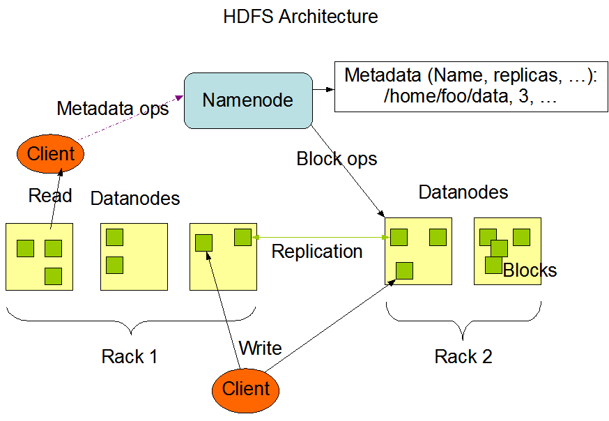

# HDFS

## NameNode和DataNode

HDFS采用master/slave架构。一个HDFS集群是由一个Namenode和一定数目的Datanodes组成。Namenode是一个中心服务器，负责管理文件系统的名字空间(namespace)以及客户端对文件的访问。集群中的Datanode一般是一个节点一个，负责管理它所在节点上的存储。HDFS暴露了文件系统的名字空间，用户能够以文件的形式在上面存储数据。从内部看，一个文件其实被分成一个或多个数据块，这些块存储在一组Datanode上。Namenode执行文件系统的名字空间操作，比如打开、关闭、重命名文件或目录。它也负责确定数据块到具体Datanode节点的映射。Datanode负责处理文件系统客户端的读写请求。在Namenode的统一调度下进行数据块的创建、删除和复制。

* DataNode中的数据是有副本存储的,所以DataNode节点是高可用的
* NameNode在2.0之后也使用了HA方案, 由专门的副本存储其EditLog

### 数据复制

HDFS被设计成能够在一个大集群中跨机器可靠地存储超大文件。它将每个文件存储成一系列的数据块，除了最后一个，所有的数据块都是同样大小的。为了容错，文件的所有数据块都会有副本。每个文件的数据块大小和副本系数都是可配置的。应用程序可以指定某个文件的副本数目。副本系数可以在文件创建的时候指定，也可以在之后改变。HDFS中的文件都是一次性写入的，并且严格要求在任何时候只能有一个写入者。

Namenode全权管理数据块的复制，它周期性地从集群中的每个Datanode接收心跳信号和块状态报告(Blockreport)。接收到心跳信号意味着该Datanode节点工作正常。块状态报告包含了一个该Datanode上所有数据块的列表。

## 副本存放

副本的存放是HDFS可靠性和性能的关键。优化的副本存放策略是HDFS区分于其他大部分分布式文件系统的重要特性。这种特性需要做大量的调优，并需要经验的积累。HDFS采用一种称为机架感知(rack-aware)的策略来改进数据的可靠性、可用性和网络带宽的利用率。目前实现的副本存放策略只是在这个方向上的第一步。实现这个策略的短期目标是验证它在生产环境下的有效性，观察它的行为，为实现更先进的策略打下测试和研究的基础。

大型HDFS实例一般运行在跨越多个机架的计算机组成的集群上，不同机架上的两台机器之间的通讯需要经过交换机。在大多数情况下，同一个机架内的两台机器间的带宽会比不同机架的两台机器间的带宽大。

通过一个机架感知的过程，Namenode可以确定每个Datanode所属的机架id。一个简单但没有优化的策略就是将副本存放在不同的机架上。这样可以有效防止当整个机架失效时数据的丢失，并且允许读数据的时候充分利用多个机架的带宽。这种策略设置可以将副本均匀分布在集群中，有利于当组件失效情况下的负载均衡。但是，因为这种策略的一个写操作需要传输数据块到多个机架，这增加了写的代价。

在大多数情况下，副本系数是3，HDFS的存放策略是将一个副本存放在本地机架的节点上，一个副本放在同一机架的另一个节点上，最后一个副本放在不同机架的节点上。这种策略减少了机架间的数据传输，这就提高了写操作的效率。机架的错误远远比节点的错误少，所以这个策略不会影响到数据的可靠性和可用性。于此同时，因为数据块只放在两个（不是三个）不同的机架上，所以此策略减少了读取数据时需要的网络传输总带宽。在这种策略下，副本并不是均匀分布在不同的机架上。三分之一的副本在一个节点上，三分之二的副本在一个机架上，其他副本均匀分布在剩下的机架中，这一策略在不损害数据可靠性和读取性能的情况下改进了写的性能。

当前，这里介绍的默认副本存放策略正在开发的过程中。

### 副本选择

为了降低整体的带宽消耗和读取延时，HDFS会尽量让读取程序读取离它最近的副本。如果在读取程序的同一个机架上有一个副本，那么就读取该副本。如果一个HDFS集群跨越多个数据中心，那么客户端也将首先读本地数据中心的副本。

## 文件系统元数据的持久化

Namenode上保存着HDFS的名字空间。对于任何对文件系统元数据产生修改的操作，Namenode都会使用一种称为EditLog的事务日志记录下来。例如，在HDFS中创建一个文件，Namenode就会在Editlog中插入一条记录来表示；同样地，修改文件的副本系数也将往Editlog插入一条记录。Namenode在本地操作系统的文件系统中存储这个Editlog。整个文件系统的名字空间，包括数据块到文件的映射、文件的属性等，都存储在一个称为FsImage的文件中，这个文件也是放在Namenode所在的本地文件系统上。

Namenode在内存中保存着整个文件系统的名字空间和文件数据块映射(Blockmap)的映像。这个关键的元数据结构设计得很紧凑，因而一个有4G内存的Namenode足够支撑大量的文件和目录。当Namenode启动时，它从硬盘中读取Editlog和FsImage，将所有Editlog中的事务作用在内存中的FsImage上，并将这个新版本的FsImage从内存中保存到本地磁盘上，然后删除旧的Editlog，因为这个旧的Editlog的事务都已经作用在FsImage上了。这个过程称为一个检查点(checkpoint)。在当前实现中，检查点只发生在Namenode启动时，在不久的将来将实现支持周期性的检查点。

Datanode将HDFS数据以文件的形式存储在本地的文件系统中，它并不知道有关HDFS文件的信息。它把每个HDFS数据块存储在本地文件系统的一个单独的文件中。Datanode并不在同一个目录创建所有的文件，实际上，它用试探的方法来确定每个目录的最佳文件数目，并且在适当的时候创建子目录。在同一个目录中创建所有的本地文件并不是最优的选择，这是因为本地文件系统可能无法高效地在单个目录中支持大量的文件。当一个Datanode启动时，它会扫描本地文件系统，产生一个这些本地文件对应的所有HDFS数据块的列表，然后作为报告发送到Namenode，这个报告就是块状态报告。

## 流水线复制

当客户端向HDFS文件写入数据的时候，一开始是写到本地临时文件中。假设该文件的副本系数设置为3，当本地临时文件累积到一个数据块的大小时，客户端会从Namenode获取一个Datanode列表用于存放副本。然后客户端开始向第一个Datanode传输数据，第一个Datanode一小部分一小部分(4 KB)地接收数据，将每一部分写入本地仓库，并同时传输该部分到列表中第二个Datanode节点。第二个Datanode也是这样，一小部分一小部分地接收数据，写入本地仓库，并同时传给第三个Datanode。最后，第三个Datanode接收数据并存储在本地。因此，Datanode能流水线式地从前一个节点接收数据，并在同时转发给下一个节点，数据以流水线的方式从前一个Datanode复制到下一个。

### 疑问

流水线复制中任意一个DataNode失败怎么办,怎么处理
